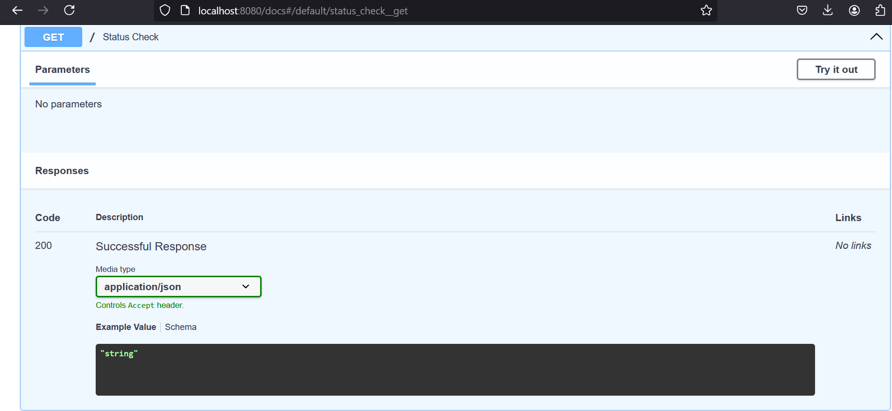

## Building Sepsis Prediction ML_API With_FastAPI


## Overview

This project provides an API for predicting the likelihood of sepsis in ICU patients using machine learning models. The API is built with FastAPI and includes endpoints for predictions using both XGBoost and Random Forest models.

## Table of Contents

- [Setup](#setup)
- [Usage](#usage)
- [Docker Hub](#docker-hub)
- [Author](#author)
- [Article](#article)
- [Screenshots](#screenshots)
- [Deployed App](#deployed-app)

## Setup

### Prerequisites

Ensure you have Docker and Docker Compose installed on your machine.

### Local Development

1. Clone the repository:

    ```sh
    git clone https://github.com/yourusername/sepsis-prediction-api.git
    cd sepsis-prediction-api
    ```

2. Build and run the Docker containers:

    ```sh
    docker-compose up --build
    ```

3. The backend API will be available at `http://localhost:8080`, and the frontend will be available at `http://localhost:8501`.

### Remote Deployment

The API is also deployed on Render. You can find the deployed version at the link below.

## Usage

### Endpoints

- **Status Check**

    ```http
    GET /
    ```

    Returns the status of the API.

- **XGBoost Prediction**

    ```http
    POST /xgboost_prediction
    ```

    Request Body:

    ```json
    {
        "PRG": 148.0,
        "PL": 85.0,
        "PR": 66.0,
        "SK": 29.0,
        "TS": 0.0,
        "M11": 33.6,
        "BD2": 0.627,
        "Age": 50.0,
        "Insurance": 1.0
    }
    ```

    Response:

    ```json
    {
        "results": {
            "prediction": "Positive",
            "probability": 87.65
        }
    }
    ```


- **Random Forest Prediction**

    ```http
    POST /random_forest_prediction
    ```

    Request Body:

    ```json
    {
        "PRG": 148.0,
        "PL": 85.0,
        "PR": 66.0,
        "SK": 29.0,
        "TS": 0.0,
        "M11": 33.6,
        "BD2": 0.627,
        "Age": 50.0,
        "Insurance": 1.0
    }
    ```

    Response:

    ```json
    {
        "results": {
            "prediction": "Negative",
            "probability": 72.34
        }
    }
    ```

### Using the Frontend

The Streamlit frontend provides an easy-to-use interface for making predictions. Follow these steps to use the frontend:

1. Open the frontend URL in your web browser:

    ```http
    http://localhost:8501
    ```

2. Fill in the input fields with the required patient data:

    - PRG: Plasma glucose
    - PL: Blood Work Result-1 (mu U/ml)
    - PR: Blood Pressure (mm Hg)
    - SK: Blood Work Result-2 (mm)
    - TS: Blood Work Result-3 (mu U/ml)
    - M11: Body mass index (weight in kg/(height in m)^2)
    - BD2: Blood Work Result-4 (mu U/ml)
    - Age: Patient's age (years)
    - Insurance: If a patient holds a valid insurance card (1 for Yes, 0 for No)

3. Select the prediction model (XGBoost or Random Forest) from the dropdown.

4. Click the "Predict" button to get the prediction results.


## Docker Hub

You can also pull the Docker image from Docker Hub and run it locally. Follow the steps below:

1. Pull the Docker images:

    ```sh
    docker pull nheldana/fastapi-sepsis-prediction:latest
    ```
    ```sh
    docker pull nheldana/streamlit-frontend:latest
    ```

2. Run the Docker container:

    ```sh
    docker run -p 8080:8000 nheldana/fastapi-sepsis-prediction:latest
    ```
    ```sh
    docker run -p 8501:8501 nheldana/streamlit-frontend:latest
    ```

3. The backend API will be available at `http://localhost:8080`.

4. The frontend will be available at `http://localhost:8501`.

## Author

👩‍💻 **Heldana Natnael Ambaw**

- GitHub: [GitHub Profile](https://github.com/heldana30)

- LinkedIn: [LinkedIn Profile](https://www.linkedin.com/in/heldana-n/)

## Article

For a detailed article explaining the project and the models used, please refer to [this link](https://medium.com/@nheldana8/sepsis-prediction-application-with-fastapi-and-streamlit-0457fe2306c6).

## Screenshots

### API Status Check




### XGBoost Prediction


### Random Forest Prediction


### Front End Interface


## Deployed App

You can access the deployed API [here](https://ml-api-with-fastapi.onrender.com/docs).

---

Thank you for using the Sepsis Prediction API! If you have any questions or feedback, please feel free to reach out.
